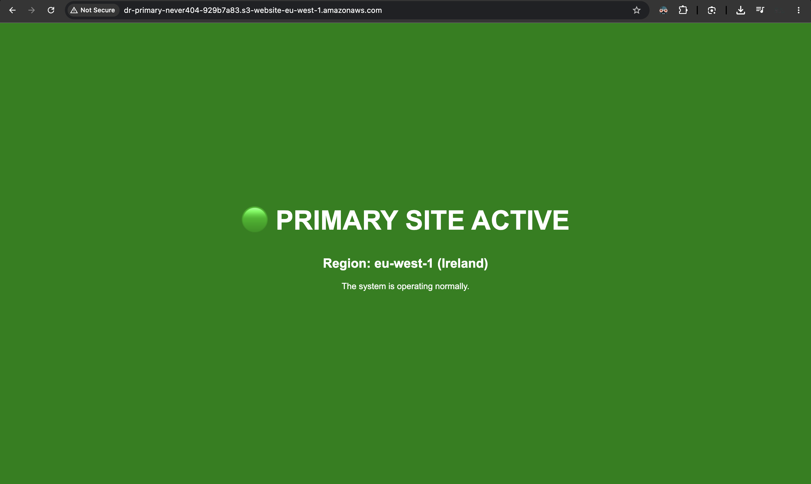
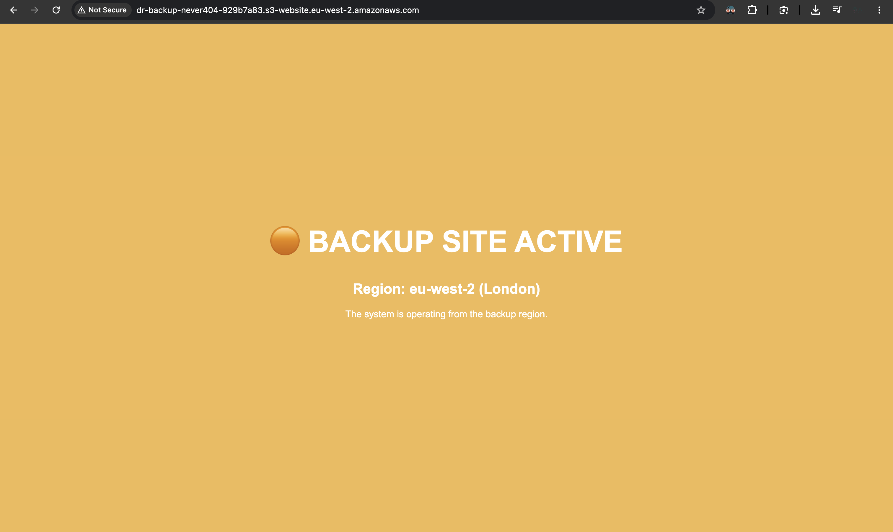
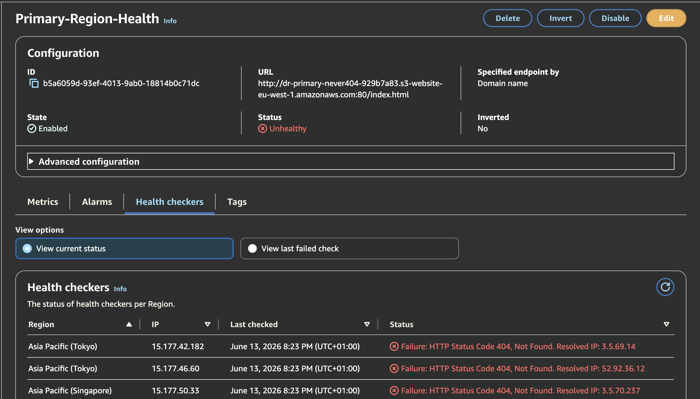
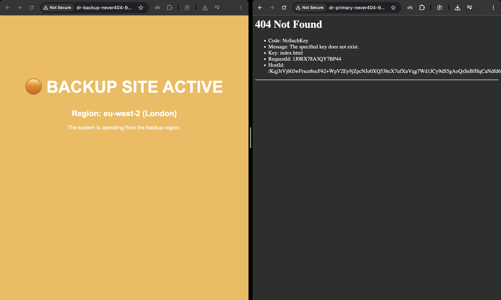

# Active-Passive Multi-Region Disaster Recovery Architecture

## 🌍 Architecture Overview
This repository contains the Infrastructure as Code (IaC) and configuration for a Multi-Region Disaster Recovery (DR) failover system. Designed for maximum High Availability (HA), this architecture ensures that if an entire AWS geographical region experiences a catastrophic outage, global web traffic is automatically rerouted to a backup data center in seconds with zero human intervention.

## 🚀 Tech Stack
* **Infrastructure as Code (IaC):** Terraform (utilizing advanced Multi-Region Provider Aliases)
* **Global DNS & Routing:** Amazon Route 53
* **Continuous Monitoring:** Route 53 Global Health Checks
* **Alerting & Telemetry:** Amazon CloudWatch Alarms
* **Storage & Hosting:** Amazon S3 (Static Website Hosting)

## 📂 Repository Structure
* `/src`: Contains the visually distinct HTML source code for the Primary (Green) and Failover (Orange) web interfaces.
* `/infrastructure`: Contains the Terraform configurations to deploy dual-region S3 buckets, upload the source code, and provision the global health check and alarm triggers.

## ⚙️ SRE & High Availability Mechanics
This project directly implements enterprise Disaster Recovery protocols to minimize Recovery Time Objective (RTO):
1. **Multi-Region Deployment:** Terraform is configured to deploy resources simultaneously to `eu-west-1` (Ireland) as the Primary site and `eu-west-2` (London) as the Standby/Backup site within a single state execution.
2. **Global Telemetry:** An Amazon Route 53 Health Check pings the Primary endpoint from a global network of servers every 30 seconds.
3. **Automated Failover Trigger:** If the Primary site fails 3 consecutive health checks, an integrated CloudWatch Alarm is triggered (`CRITICAL-Primary-Site-Offline`), executing the DNS failover protocol to reroute all incoming traffic to the London data center.

## 🚀 Deployment Runbook

**1. Provision the Global Infrastructure:**
Deploy the dual-region buckets, upload the web assets, and establish the Route 53 telemetry.
```bash
cd infrastructure
terraform init
terraform apply
```

**2. Chaos Engineering (Live Fire Disaster Simulation):**
To verify the automated DR protocol, deliberately simulate a regional outage by destroying the Primary Site's core web asset via the Terraform CLI:

```bash
terraform destroy -target="aws_s3_object.primary_index"
```

Wait 60 to 90 seconds. Route 53 will detect the dropped packets, flag the region as Unhealthy, and trigger the CloudWatch Failover Alarm.

### 📸 Chaos Engineering Evidence

*Visual difference between Primary (Green) and Backup (Orange) sites:*



*Route 53 Health Check flipping to RED/UNHEALTHY & CloudWatch Alarm Triggered:*


*Failover Result (Traffic rerouted to London Backup Site):*
